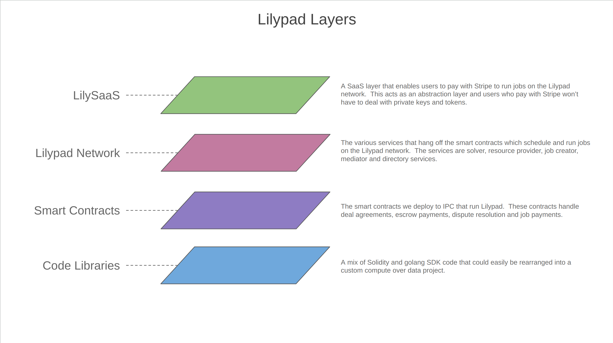
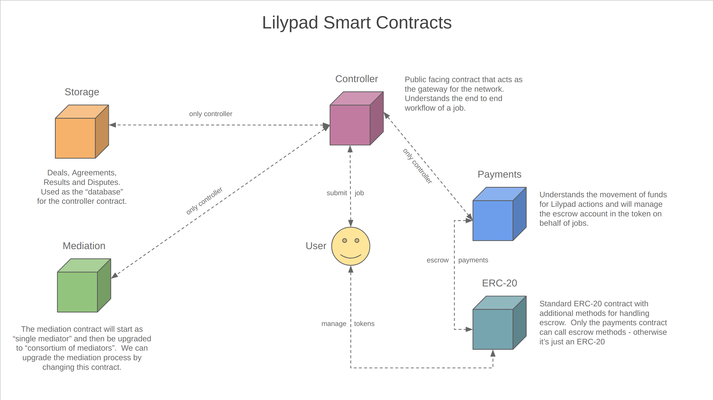
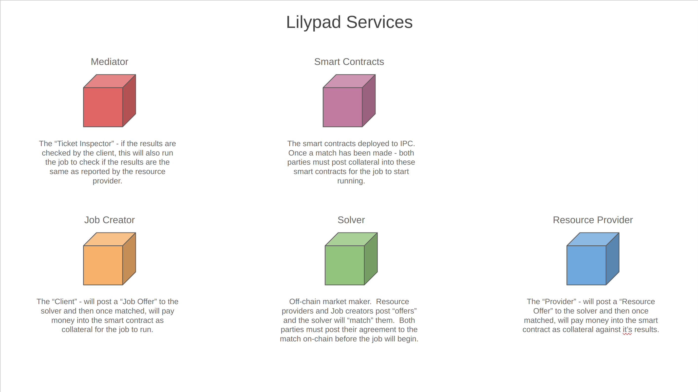
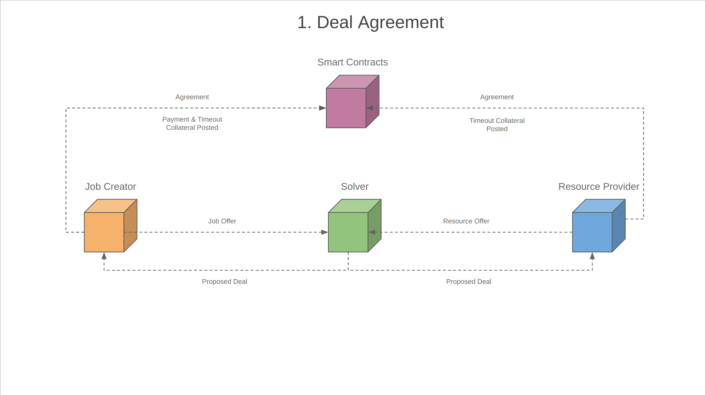
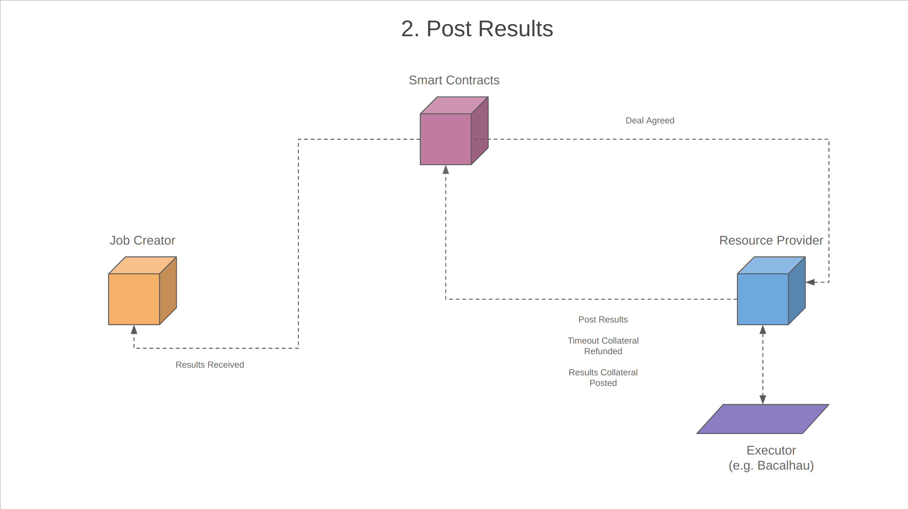
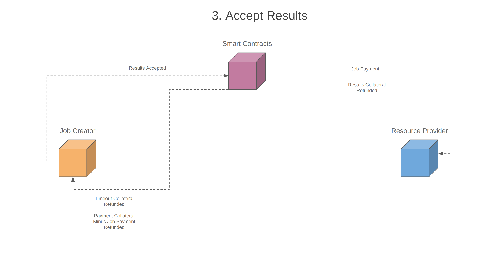
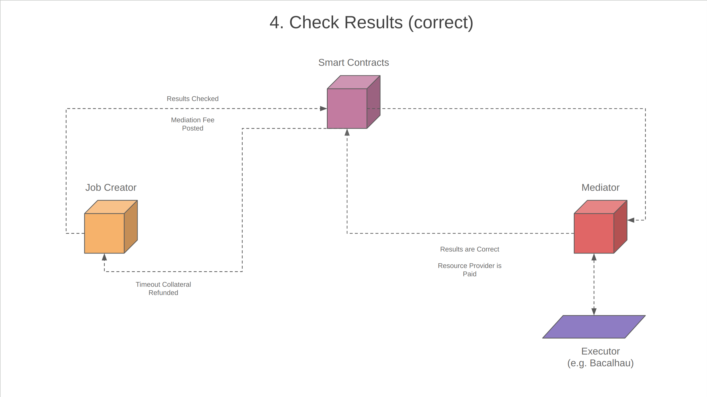
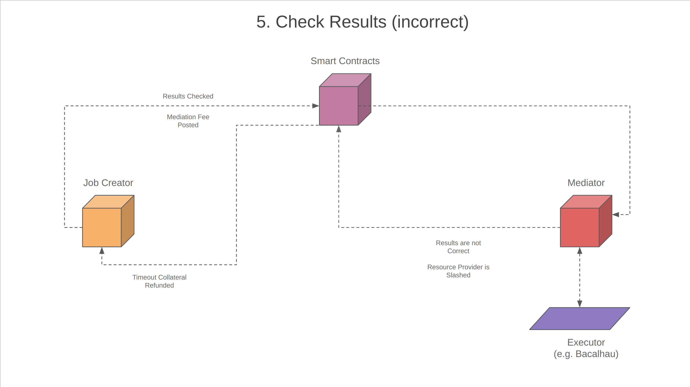
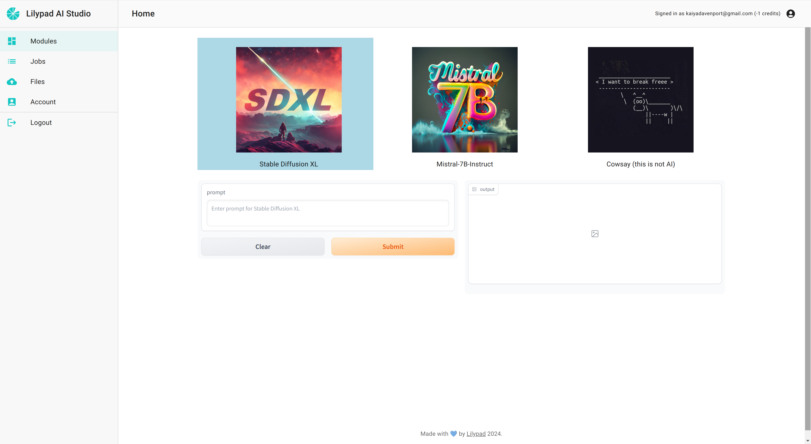

## table of contents

 * [architecture](#architecture)
   * [layers](#layers)
   * [smart contracts](#smart-contracts)
   * [services](#services)
   * [job workflow](#job-workflow)
 * [local development](#local-development)
   * [pre-requisites](#pre-requisites)
   * [initial setup](#initial-setup)
   * [run web3 stack](#run-web3-stack)
   * [run services](#run-services)
   * [run saas](#run-saas)
   * [run faucet](#run-faucet)
   * [run jobs](#run-jobs)
   * [stop stack](#stop-stack)
   * [unit tests](#unit-tests)
   * [regenerating go bindings](#regenerating-go-bindings)
 * [production deployment](#production-deployment)
   * [generate production keys](#generate-production-keys)
   * [funding accounts](#funding-accounts)
   * [deploy contracts](#deploy-contracts)
     * [add hardhat network](#add-hardhat-network)
     * [deploy contracts](#deploy-contracts-1)
     * [note addresses](#note-addresses)
   * [generate service .env files](#generate-service-env-files)
   * [systemd files](#systemd-files)
   * [running the saas layer](#running-the-saas-layer)
 * [troubleshooting](#troubleshooting)
   * [receive buffer size error](#receive-buffer-size-error)

## architecture

### layers

The following diagram shows the high level architecture of the system:



### smart contracts

The following diagram shows the various smart contracts that are part of the system:



### services

The following diagram shows the various services that are part of the system:



### job workflow

The following diagram shows the workflow of a job:

#### 1.Deal Agreement

First, the deal is matched by the solver and agreed to by both sides:



#### 2.Post Results

Then, the resource provider posts the results of the job:



#### 3.Accept Results

In the case that the job creator is happy, they will acept the results:



#### 4.Check Results (correct)

In the case that the job creator is not happy but the resource provider was honest:



#### 5.Check Results (incorrect)

In the case that the job creator is not happy but the resource provider was not honest:



## local development

This section will demonstrate how to run the stack on your local machine.

### pre-requisites

You will need the following tools:

 * go (>= v1.20)
   * see [golang-backports](https://launchpad.net/%7Elongsleep/+archive/ubuntu/golang-backports) for ubuntu
 * docker
   * `docker.io` ubuntu package is sufficient for controlplane
   * use [docker on ubuntu](https://docs.docker.com/engine/install/ubuntu/) and [nvidia-container-toolkit](https://docs.nvidia.com/datacenter/cloud-native/container-toolkit/latest/install-guide.html) for GPU-enabled resource-providers (these will be preinstalled in certain environments, e.g. Lambda Labs)
 * node.js (>= v16)
   * see [nodesource distributions](https://github.com/nodesource/distributions?tab=readme-ov-file#installation-instructions)
   * also install yarn globally: `sudo npm install -g yarn`

### initial setup

These steps only need to be done once.

#### install bacalhau

We are currently pinned to bacalhau v1.0.3 - to install this version run the following commands:

```bash
wget https://github.com/bacalhau-project/bacalhau/releases/download/v1.0.3/bacalhau_v1.0.3_linux_amd64.tar.gz
# Extract the downloaded archive and move the `bacalhau` binary to `/usr/local/bin`
tar xfv bacalhau_v1.0.3_linux_amd64.tar.gz
sudo mv bacalhau /usr/local/bin
```

#### clone faucet repo

The [faucet](https://github.com/CoopHive/faucet.coophive.network) allows us to mint tokens for testing purposes.

We first need to clone the repo:

```bash
# run this command at the same level as the coophive repo
git clone https://github.com/CoopHive/eth-faucet
```

#### install stack

```bash
cd coophive
./stack install
```

This script will:

 * build the faucet docker image from the locally cloned repo
 * download the go modules
 * install the node modules for hardhat
 * install the node modules for the frontend
 * compile the solidity contracts and generate the typechain bindings
 * generate the dev `.env` file with insecure private keys

After you've run the install script - you can look inside of `.env` to see the core service private keys and addresses that are used in the local dev stack.

### run web3 stack

These steps boot geth, deploy our contracts and ensure that the various services named in `.env` are funded with ether and tokens.

```bash
cd coophive
./stack boot
```

This script will:

 * start geth as a docker container
 * fund the admin account with ether
 * fund the various services with ether
 * compile and deploy the solidity contracts
 * fund the various services with tokens
 * print the balances of the various accounts in `.env` 

### run services

#### solver

Run the following commands in separate terminal windows:

```bash
./stack solver
```

**NOTE** if you want to run the SAAS layer then we need to run the solver on the docker bridge as follows:

```bash
./stack solver --server-url http://172.17.0.1:8080
```

#### mediator

Wait for the solver to start when `🟡 SOL solver registered` is logged, and then, in another terminal window, run:

```bash
./stack mediator
```

#### jobcreator

In another terminal window run:

```bash
./stack jobcreator
```

#### bacalhau

In another terminal window run:

```bash
# Set the IPFS data path by exporting the `BACALHAU_SERVE_IPFS_PATH` variable to your desired location
export BACALHAU_SERVE_IPFS_PATH=/var/lib/hive/data/ipfs
sudo mkdir -p ${BACALHAU_SERVE_IPFS_PATH}
./stack bacalhau-serve
```

#### resource-provider

If you have a GPU, run the following command in a separate terminal window:

```bash
./stack resource-provider --offer-gpu 1
```

Otherwise, if you don't have a GPU:

```bash
./stack resource-provider
```

### run saas

The coophive repo also comes with a saas layer that can be used as a web2 layer to the underlying web3 stack.



The api will run using a `WEB3_PRIVATE_KEY` and essentially act as a job creator on behalf of registered users.

This means you can open up your decentralized compute network to a wider audience who might not have access to metamask or other web3 tools.

Once the core network is up and running as described above, you can run the saas layer as follows:

**NOTE** it's important that you started the solver using the `./stack solver --server-url http://172.17.0.1:8080` command as described above.

```bash
docker-compose build
docker-compose up -d
```

Now you should be able to access the saas layer using http://localhost

### run faucet

To run the faucet container so you can test with other user accounts:

```bash
./stack faucet
```

Once the faucet is running, you can access it using http://localhost:8085

**NOTE**: if you want a different logo or otherwise a different design for the faucet, fork the [repo](https://github.com/bacalhau-project/eth-faucet) and use that as your basis for the faucet container.

You can find the frontend code in the `web` directory and the images are in the `web/public` directory.

### run jobs

Now you can run jobs on the stack as follows:

```bash
./stack run cowsay:v0.0.1 -i Message="moo"
```

If you have a GPU node - you can run SDXL (which needs a GPU):

```bash
./stack runsdxl sdxl:v0.2.9 PROMPT="beautiful view of iceland with a record player"
```

To demonstrate triggering jobs being run from on-chain smart contracts:

```bash
./stack run-cowsay-onchain
```

### stop stack

To stop the various services you have started in the numerous terminal windows, `ctrl+c` will suffice.

To stop geth:

```bash
./stack geth-stop
```

To stop the faucet:

```bash
./stack faucet-stop
```

To reset Geth data, effectively performing a complete restart, use the following command:

```bash
./stack clean
```

Please note that after running `clean`, you will need to re-run the `fund-admin` and `fund-services` commands.

### unit tests

Run the smart contract unit tests with the following command:

```bash
./stack unit-tests
```

### regenerating go bindings

Whenever you make changes to the smart contracts, regenerate the Go bindings in `pkg/contract/bindings/contracts` by running:

```bash
./stack compile-contracts
```

## production deployment

Running the coophive in a production environment will require:

 * an EVM compatible blockchain for which you have a private key with funds
   * you will use this `admin` private key to fund our various services
 * a VM (or multiple) connected to the Internet
   * the solver will require a public http(s) endpoint
   * it is recommended that you use a reverse proxy to terminate TLS and forward to the solver
 * a compiled binary of bacalhau `v1.0.3`
   * see the development instructions for how to get this onto the machine
   * it must live on the VM at the `/usr/bin/bacalhau` path
 * a compiled binary of the coophive
   * this can be compiled locally or in CI
   * it must live on the VM at the `/usr/bin/coophive` path
 * docker running on the vm that will serve the faucet and saas platform
   * the faucet and saas will require a public http(s) endpoint
   * it is recommended that you use a reverse proxy to terminate TLS and forward to these services

We will use hardhat to deploy our contracts and then a combination of systemd and docker-compose to manage our services.

### generate production keys

Regardless of what blockchain we use, we will need the private keys and associated addresses for each of our services.

To generate these for a new deployment - you can run the following command:

```bash
./stack generate-addresses
```

This will print the private keys and addresses to stdout so to create a production `prod.env` file, you can do the following:

```bash
./stack generate-addresses > prod.env
```

### funding accounts

Each of our services will need some base currency to pay gas and for a production deployment, you will need to fund these accounts manually.  This is by design as compared to the local dev stack (where we use a script) because there are various block-chains and account arrangements that could be used for different networks.

This is just to pay gas - we will deploy the hive ERC-20 token to pay for jobs.

**NOTE** it should be fairly trivial to change the payments contract to re-use an existing ERC-20 token.

You can see the account addresses by looking in the `prod.env` you just made.

The following is a list of each account that needs to be funded:

 * `ADMIN`
 * `FAUCET`
 * `SOLVER`
 * `MEDIATOR`
 * `RESOURCE_PROVIDER`

All of these accounts will need enough ether to pay for gas, how much this is depends on the network you are using (i.e. how much gas costs) and how busy that network is.

We recommend looking at the balances of the local dev stack to understand how much ether will be required to pay gas.

In a production network - the `JOBCREATOR` will be end users who should get their own either to pay gas (this also applies to tokens to pay for jobs).

### deploy contracts

Now it's time to deploy our contracts to the blockchain we are using, to do this, we need to add a `network` to the hardhat config.

#### add hardhat network

Open `hardhat/hardhat.config.ts` and add a new network to the `networks` array:

Obviously change these values to match your network:

```typescript
{
  name: "production",
  url: "https://mainnet.infura.io/v3/PROJECT_ID",
  accounts: [process.env.ADMIN_PRIVATE_KEY],
  chainId: 1,
  gasPrice: 100000000000,
  gas: 10000000,
  timeout: 600000,
}
```

#### deploy contracts

Then we can deploy our contracts using the following command:

```bash
DOTENV_CONFIG_PATH='../prod.env' npx hardhat deploy --network production
```

It's important to set the `DOTENV_CONFIG_PATH` value so we use the actual admin account we just funded.

It's also important to match the `--network production` to the name of the network you actually added to `hardhat.config.ts`.

#### note addresses

Once the contracts have been deployed - make a note of the addresses they have been deployed to (hardhat will print these to stdout or you can look in `hardhat/deployments/production/<ContractName>.json`).

We will be required to add some of these contract addresses to `.env` files later.

### generate service .env files

Now we need to create the `.env` files for each of our services.  Once created, we will upload these files to the vm(s) you are going to run the services on and then configure the systemd units to use them.

The systemd units in the `systemd` folder all mention `/app/coophive` as the location of their `.env` files, you are free to change the name of this folder (as long as you then upload the `.env` files you create to that folder).

We also need to have a data folder for `ipfs` - like above, the systemd units are configured to point at `/app/coophive/ipfs` - you can change this folder but make sure to update the systemd units to what you created on the vm.

The format of these files is classic env format as follows (using the solver as an example):

```
WEB3_PRIVATE_KEY=XXX
SERVER_PORT=80
SERVER_URL=https://my-cool-network.io
```

**NOTE** in the example above - we will have setup a TLS terminating reverse proxy such that `https://my-cool-network.io` will forward to the solver VM on port 80.

The following is a guide to each of the `.env` files that need creating:

`solver.env`

 * `WEB3_PRIVATE_KEY` (copy `SOLVER_PRIVATE_KEY` from `prod.env`)
 * `SERVER_PORT` (the port the solver will listen on)
 * `SERVER_URL` (the public http(s) endpoint of the solver)

`job-creator.env`

 * `WEB3_PRIVATE_KEY` (copy `SOLVER_PRIVATE_KEY` from `prod.env`)
 * `SERVICE_SOLVER` (the solver contract address copied from the output of `hardhat deploy`)
 * `SERVICE_MEDIATORS` (copy `MEDIATOR_ADDRESS` from `prod.env`)

`resource-provider.env`

 * `WEB3_PRIVATE_KEY` (copy `RESOURCE_PROVIDER_PRIVATE_KEY` from `prod.env`)
 * `SERVICE_SOLVER` (the solver contract address copied from the output of `hardhat deploy`)
 * `SERVICE_MEDIATORS` (copy `MEDIATOR_ADDRESS` from `prod.env`)

`resource-provider-gpu.env`

 * `WEB3_PRIVATE_KEY` (copy `RESOURCE_PROVIDER_PRIVATE_KEY` from `prod.env`)
 * `SERVICE_SOLVER` (the solver contract address copied from the output of `hardhat deploy`)
 * `SERVICE_MEDIATORS` (copy `MEDIATOR_ADDRESS` from `prod.env`)

`mediator.env`

 * `WEB3_PRIVATE_KEY` (copy `MEDIATOR_PRIVATE_KEY` from `prod.env`)
 * `SERVICE_SOLVER` (the solver contract address copied from the output of `hardhat deploy`)

Once you have created these files - you can upload them to the VM(s) you are going to run the services on.

### systemd files

Upload the various systemd files from the `systemd` folder to the VM(s) you are going to run the services on.

You can now start and stop the various services using `systemd` and see logs using `journalctl`.

Make sure you start the solver first.

### running the saas layer

To run the saas layer in production it's important to use another machine than the solver so the saas api can speak to the solver using it's public http(s) endpoint.

To run the various services there are a few options:

 * use the `docker-compose.yaml` file but change some values
 * run the various services using another tool like k8s (they are all docker based services)
 * run the various services using systemd

We have left this choice to the reader as it depends on the environment you are deploying to.

## troubleshooting

### receive buffer size error

`failed to sufficiently increase receive buffer size` See https://github.com/quic-go/quic-go/wiki/UDP-Receive-Buffer-Size for details. Fix for Linux:
```
sudo sysctl -w net.core.rmem_max=2500000
sudo sysctl -w net.core.wmem_max=2500000
```
